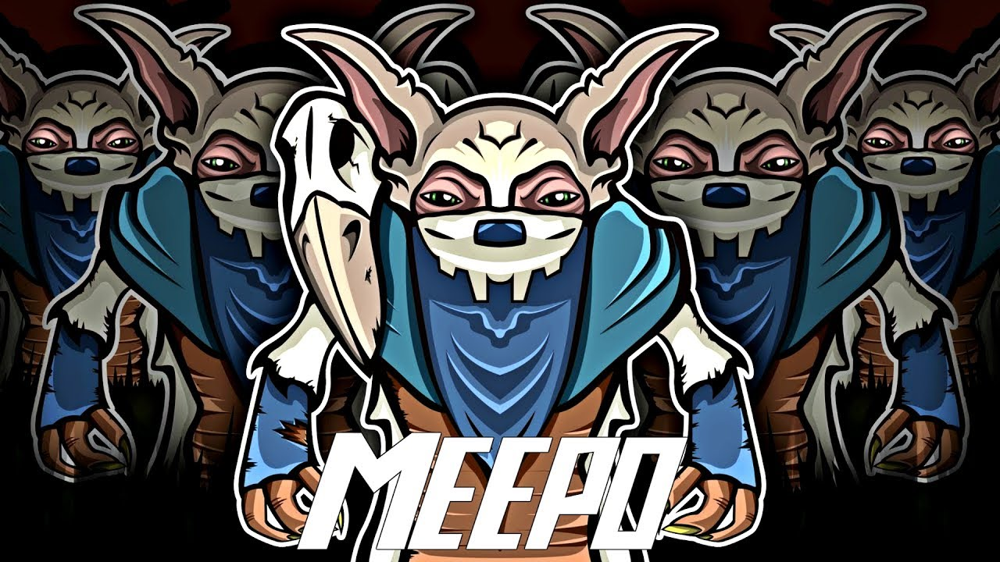

# Meepo JS




Production - `https://cdn.jsdelivr.net/gh/kotAPI/meepo-js@v1.0/dist/meepo.min.js`


### Usage

Add the script to your HTML
```html
<script src="./meepo.js"></script>
```

#### Loading the scripts 
```javascript
meepoJS.loadScripts(["script1","script2","script3"....,"script-n"],configObject).then(res => {
	console.log(res);
});
```

#### Understanding the response Object

The `loadScripts` function returns an object on loading all the scripts in the sequence,
the `status` is true if all scripts have loaded successfully, shows false if any of the script has failed.

Also returns two arrays of fields 'successful_URLs' and 'failed_URLs' that contain loaded scripts and failed script URLS respsectively

```javascript
{
	"status":true,
	"successful_URLs":[],
	"failed_URLs":[]
}
```

#### ConfigObject

```javascript
configObject:{
	logging:true
}
```
pass this object for extra functionality

set `logging` to true if you want to log loaded/failed scripts and other log-based information.


# Contributing

We use babel-minify `https://github.com/babel/minify/tree/master/packages/babel-minify` to minify our final code.

Install this package and uglify the source into the dist folder with the name 'meepo.min.js'before sending a PR.

### Installing babel-minify

Use sudo if you're bombarded with no-enough-access errors
```
npm install babel-minify -g
```

then,

```
minify meepo.js --out-file dist/meepo.min.js
```

And then send a PR


#### Credits/ Disclaimer


- If you're a fan of DotA like me, the name for this library is inspired from a hero called 'meepo' from  DotA whose ultimate is named "Divided we stand, Divided we fall." which translates into development world very well in a sense. If one of the dependent script fails to load, the whole app crashes, pun intended.

(Image) - I do not own or have copyrights to the image used in the readme, I'd love to credit the original author. Please raise an issue if you know the original artist.

- The name and the image isn't owned by me and belongs to DotA2.